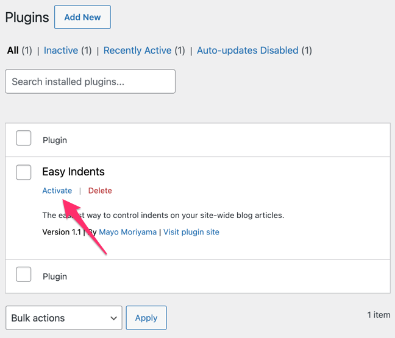

# Easy Indents
- Contributors: mayukojpn
- Tags: indent, blogging, Japanese
- Requires at least: 1.5
- Tested up to: 6.3.1
- Stable tag: 1.0
- License: GPLv2 or later
- License URI: https://www.gnu.org/licenses/gpl-2.0.html

サイトのブログ記事全体を字下げします。

スペースの追加やテーマの改造といったややこしい作業はもう必要ありません。プラグインをインストールして有効化するだけ。

## インストール

1. [Zip ファイルをダウンロード](https://github.com/mayukojpn/easy-indents/archive/refs/heads/ja.zip)します。
1. `easy-indents` フォルダー全体を `/wp-content/plugins/` ディレクトリにアップロードします。
2. **プラグイン**を開きます。
3. Easy Indents プラグインを有効化します。

## スクリーンショット

